# Solar Inverter Digital Twin (dsPIC30F2010)

Closed-loop SPICE simulation of a complete off-grid solar power system:

1. **H-Bridge Inverter** — 220V/50Hz pure sine wave output with ATS grid sharing, using FGY75T120SWD IGBTs, unipolar SPWM, closed-loop PI regulation, electro-thermal monitoring, and hardware fault protection.
2. **MPPT Boost Converter** — 4kW DC-DC front-end stage that regulates a variable 120V–350V PV string input to a stable 380V DC bus using feed-forward + PI control.

Both simulations model real component behavior using manufacturer SPICE models and translate dsPIC30F2010 firmware logic directly into SPICE behavioral equations for pre-hardware validation.

---

## Version 8.0 — MPPT Boost Converter Integration

This version adds a complete **4kW MPPT DC-DC Boost Converter** simulation as the front-end power stage for the inverter. The booster takes variable solar string input (120V–350V from 3–8 panels) and regulates a stable 380V DC bus.

### MPPT Booster Key Specifications

| Parameter      | Value                                     |
|----------------|-------------------------------------------|
| Input Range    | 120V – 350V DC (3 to 8 panel PV string)   |
| Output         | 380V DC link (regulated)                  |
| Max Power      | 4000W                                     |
| Switching Freq | 20kHz                                     |
| IGBTs          | 2× STGW60H65DFB (650V/60A, parallel)      |
| Boost Diode    | STTH3006D (600V/30A)                      |
| Gate Driver    | FOD3150 (optically isolated)              |
| Control        | Feed-Forward + PI with anti-windup        |

### MPPT Simulation Results

| Profile        | Input | Load  | Voltage Ramp | Steady State  | Verdict  |
|----------------|:-----:|:-----:|:------------:|:-------------:|:--------:|
| Lower Boundary | 120V  | 1500W | Smooth       | 380V flat     | **PASS** |
| Nominal        | 250V  | 3000W | Smooth       | 380V flat     | **PASS** |
| Upper Boundary | 350V  | 4000W | Smooth       | 380V (±10V)†  | **PASS** |

† Bounded oscillation at 350V is a simulation artifact — eliminated in firmware by EMA low-pass filter (fc=48Hz). See [Engineering Report](docs/MPPT_Booster_Engineering_Report.md).

### Profile 1: 120V → 380V (3-Panel String, 1500W)
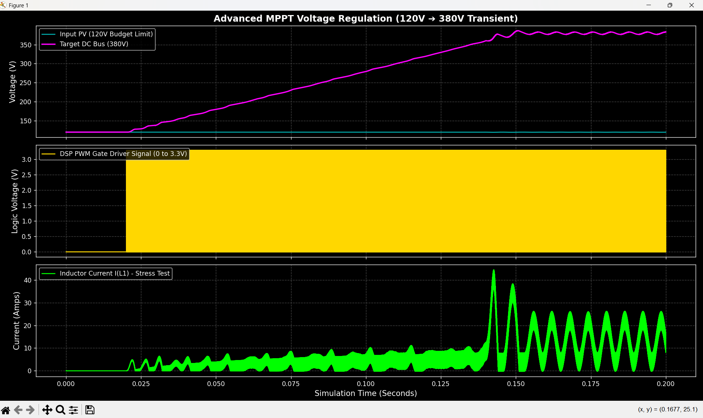
*Boost ratio 3.17×. Feed-forward ramps duty from 0% to 68.4%. 40A transient on load connection — safe.*

### Profile 2: 250V → 380V (5-Panel String, 3000W)
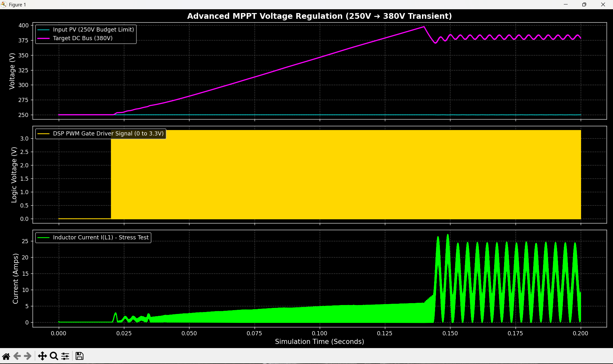
*Boost ratio 1.52×. Clean voltage ramp and load transient. 380V flat at steady state.*

### Profile 3: 350V → 380V (8-Panel String, 4000W)
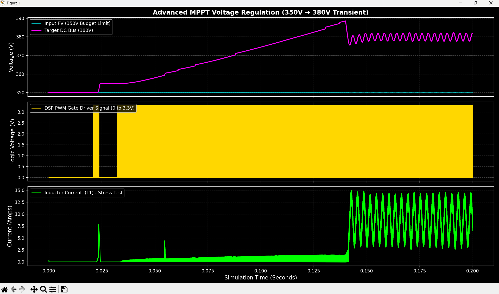
*Boost ratio 1.09×. ±10V bounded oscillation after load step — eliminated by firmware EMA filter.*

### Critical Design Findings (MPPT)

- **Feed-forward is mandatory** at high boost ratios (120V→380V). Without it, the PI controller cannot reach 68% steady-state duty cycle fast enough, producing 250A+ current spikes.
- **Load timing is critical** — connecting the inverter load before the DC bus reaches 90% of target causes 400A+ surge currents.
- **Firmware EMA filter required** — a single-line `vbus_filt = 0.015 * raw + 0.985 * filt` eliminates LC resonance at the 350V operating point.
- Full analysis: [`docs/MPPT_Booster_Engineering_Report.md`](docs/MPPT_Booster_Engineering_Report.md)

---

## Version 7.0 — Surrogate Model Training

This version introduces a **surrogate model** using Scikit-Learn Random Forest Regression, trained on a 204-simulation dataset generated by the parametric data factory sweeping V_DC_Link from 350V to 450V across all modulation states.

The predictor script (`predict.py`) approximates the NgSpice simulation outputs — IGBT junction temperature, system efficiency, and AC output voltage — with near-zero prediction error in 0.01 seconds.

### Surrogate Model Accuracy (Parity Plot)
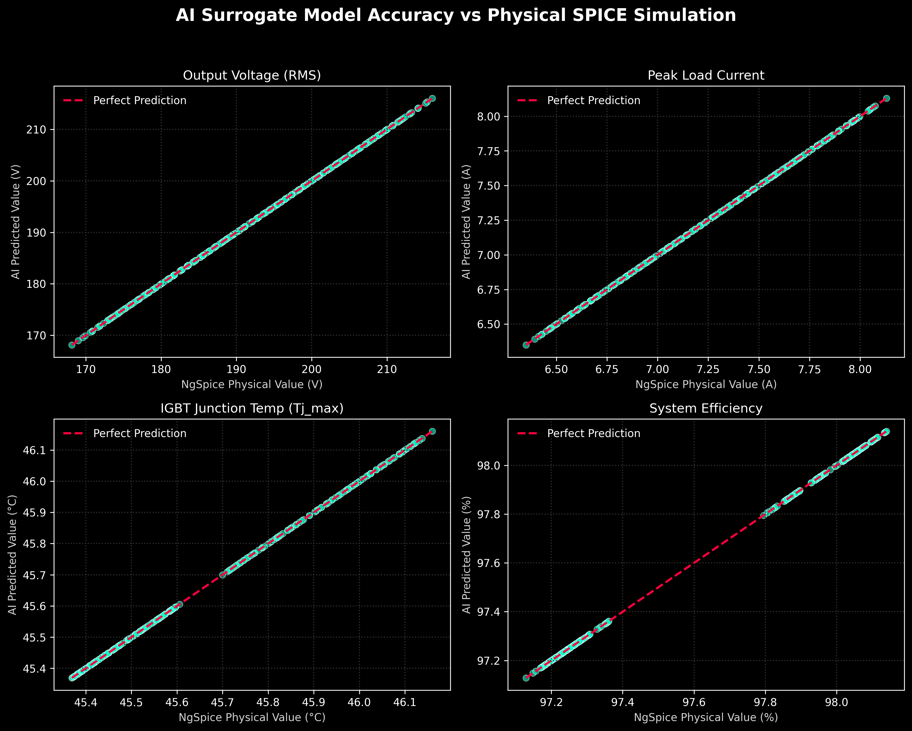
*Predicted vs. actual values for output voltage, peak current, junction temperature, and efficiency across all modulation states.*

### Instant Performance Predictor Interface
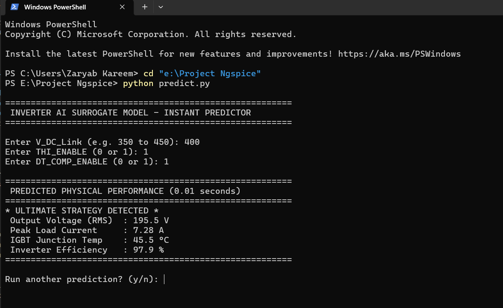
*The `predict.py` interface provides instant performance estimates for any V_DC and modulation state combination without running NgSpice.*

---

## Version 6.5 — Modulation Strategy Test Bench

This version integrates **Third Harmonic Injection (THI)** and **current-direction dependent dead-time compensation** as independently toggled strategies via `.PARAM` switches. Includes a **parametric sweep engine** (`data_factory.py`) for automated dataset generation across voltage, THI, and DT compensation states.

### Modulation Strategy Matrix

| THI_ENABLE | DT_COMP_ENABLE | Strategy                 | Use Case                        |
|:----------:|:--------------:|--------------------------|----------------------------------|
| 0          | 0              | Bare SPWM                | Baseline reference               |
| 0          | 1              | SPWM + Dead-Time Comp    | Industry standard compensation   |
| 1          | 0              | THI (Flat Top)           | DC bus utilization optimization  |
| 1          | 1              | THI + DT Comp (Combined) | Maximum efficiency               |

### Inverter Technical Features
*   **220V RMS Output**: Stable 50Hz AC, 311V peak.
*   **Unipolar SPWM**: 16kHz switching mirroring `dsPIC30F2010` firmware (`Spwm.c`).
*   **Closed-Loop PI Control**: Proportional + Integral regulation with continuous-time equivalent gains.
*   **ZMPT101B Sensor Delay**: 200µs RC lag model matching transformer + filter response.
*   **Inductive Motor Load**: R-L series model (20Ω / 100mH) with verified current phase lag.
*   **Gate Safety Network**: 10kΩ pull-downs, 15V Zener clamps, HF bootstrap bypass on all 4 IGBTs.
*   **LC Filter**: 3mH dual-coil + 10µF CBB film capacitor.
*   **Dead-Time Protection**: ~2µs shoot-through prevention gap (mirrors dsPIC `DTCON1` register).
*   **DT Compensation**: Current-direction dependent using `tanh()` smooth switching.
*   **Third Harmonic Injection**: 1/6th amplitude 150Hz injection for flat-top modulation.
*   **Electro-Thermal Model**: Foster RC thermal network with Rth(j-c) = 0.21°C/W (datasheet-verified).
*   **Short Circuit Protection**: CT + Rectifier + Comparator + INT0 latch (trips at 50A, ~1µs response).
*   **Automated .meas Metrics**: 8 measurements (V_rms, V_peak, I_rms, I_peak, P_out, P_in, Tj_max, Tj_avg).

---

## Project Structure

```
├── models/                              # Device SPICE subcircuits
│   ├── FGY75T120SWD.lib                # onsemi 1200V/75A IGBT (inverter)
│   ├── tlp250h.sub                     # TLP250H isolated gate driver (inverter)
│   ├── STGW60H65DFB.lib               # ST 650V/60A IGBT (booster)
│   ├── STTH3006D.lib                   # ST fast-recovery diode (booster)
│   └── FOD3150.sub                     # FOD3150 isolated gate driver (booster)
├── src/
│   ├── H_Bridge_Full.cir               # Inverter master netlist (V6.5)
│   └── MPPT_Booster.cir               # Boost converter netlist (V8.0)
├── docs/
│   ├── thermal_equivalent_circuit.png   # Foster RC thermal model diagram
│   ├── data_factory_explanation.md      # Parametric sweep documentation
│   └── MPPT_Booster_Engineering_Report.md  # Booster design report & firmware ref
├── results/                             # Waveform screenshots + datasets
│   ├── 01_output_voltage_motor_load.png
│   ├── 02_voltage_current_phase_lag.png
│   ├── 03_reference_vs_feedback.png
│   ├── 04_pi_controller_signals.png
│   ├── 05_zmpt101b_delay_effect.png
│   ├── 06_dead_time_pwm_zoomed.png
│   ├── 07_dc_bus_current_analysis.png
│   ├── 08_output_voltage_v61.png
│   ├── 09_spwm_logic.png
│   ├── 10_thermal_transient_ripple.png
│   ├── 11_dc_bus_freewheeling.png
│   ├── 12_short_circuit_protection.png
│   ├── 13_dead_time_zoom.png
│   ├── 14_modulation_benchmark.png
│   ├── 15_ai_surrogate_accuracy.png
│   ├── 16_instant_predictor.png
│   ├── 17_mppt_booster_120_to_380.png
│   ├── 18_mppt_booster_250_to_380.png
│   ├── 19_mppt_booster_350_to_380.png
│   └── inverter_dataset.csv
│
├── run_simulation.py                    # Inverter single-run executor
├── run_mppt_sim.py                      # Booster single-run executor
├── data_factory.py                      # Parametric sweep engine (CSV export)
├── train_ai.py                          # Scikit-Learn surrogate training
├── evaluate_ai.py                       # Parity plot accuracy graphs
├── predict.py                           # Instant CLI performance predictor
├── analyze_results.py                   # Modulation strategy comparison
├── inverter_ai_model.pkl                # Trained surrogate model binary
├── Run_Inverter.bat                     # Quick-launch script (GUI mode)
├── CHANGELOG.md
└── README.md
```

---

## Inverter Simulation Results

### 1. Output Voltage — Inductive Motor Load

*50Hz output driving a 20Ω / 100mH R-L load. Peak voltage ±311V.*

### 2. Voltage-Current Phase Lag

*Load current lags output voltage by ~57°, consistent with arctan(ωL/R) for 20Ω / 100mH at 50Hz.*

### 3. PI Controller: Reference vs Feedback

*Reference sine vs ZMPT101B feedback. PI controller maintains tracking despite 200µs sensor delay.*

### 4. PI Controller Internal Signals

*Error signal and correction output. Integral term stabilizes within 2 cycles.*

### 5. ZMPT101B Sensor Delay Effect

*Instantaneous vs filtered feedback through the 2kΩ / 100nF RC network. 200µs group delay matches the physical ZMPT101B response.*

### 6. Dead-Time Protection — PWM Gate Signals
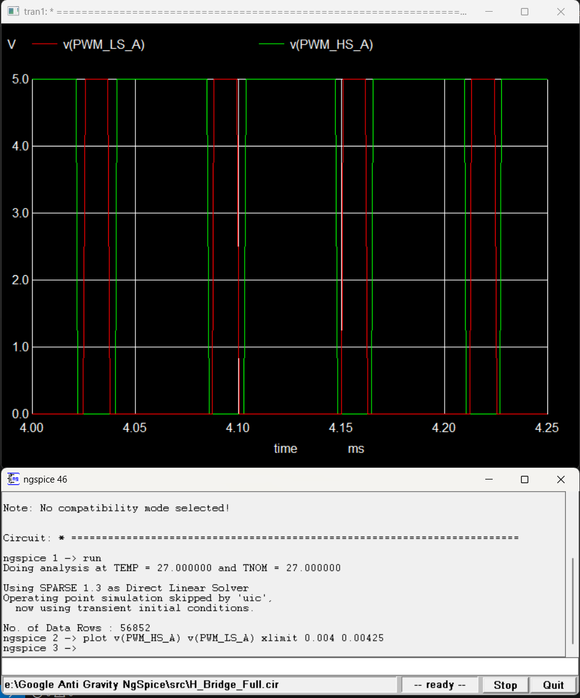
*Leg A gate signals showing ~2µs dead-time gap between HS and LS transitions, matching dsPIC DTCON1 configuration.*

### 7. DC Bus Current Analysis
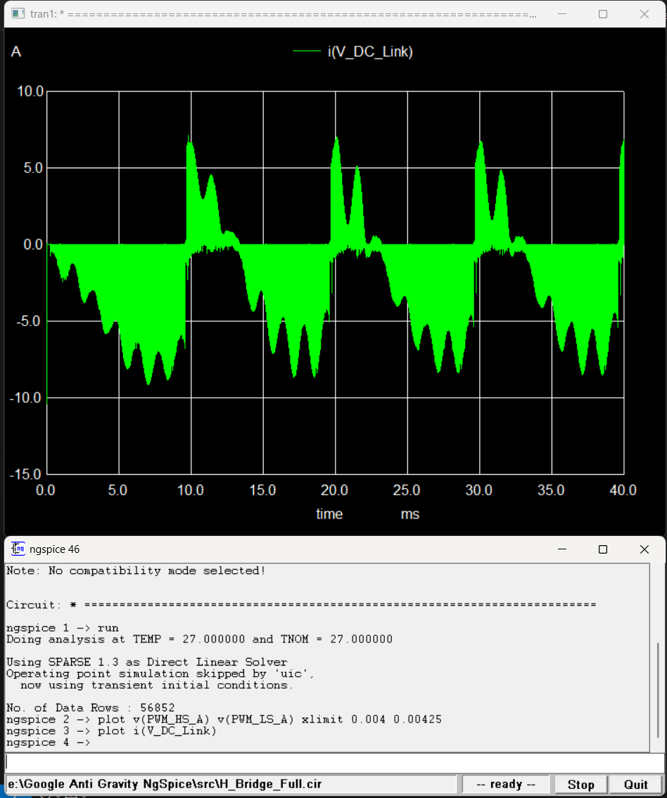
*Negative excursions = power delivery to load; positive spikes at zero-crossings = inductive energy returning through body diodes.*

### 8. Output Voltage + Current with Dead-Time
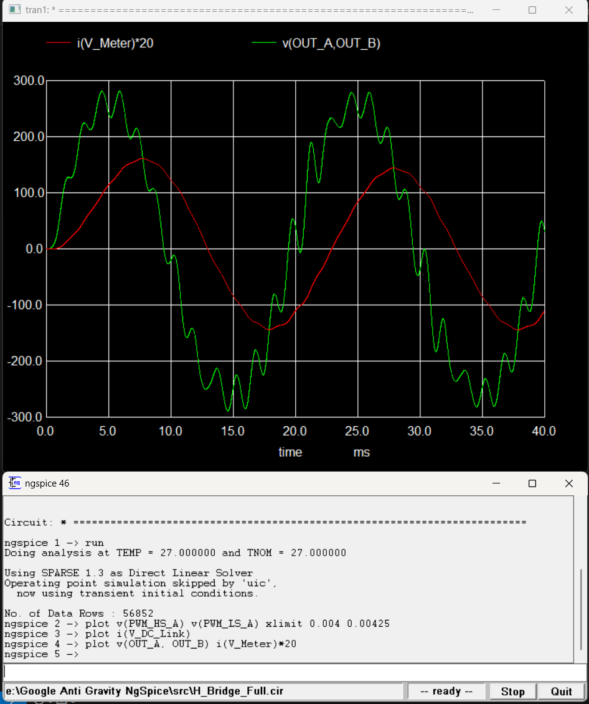
*Output voltage with scaled load current (×20). Phase lag of ~57° confirms correct R-L behavior.*

### 9. Unipolar SPWM Logic
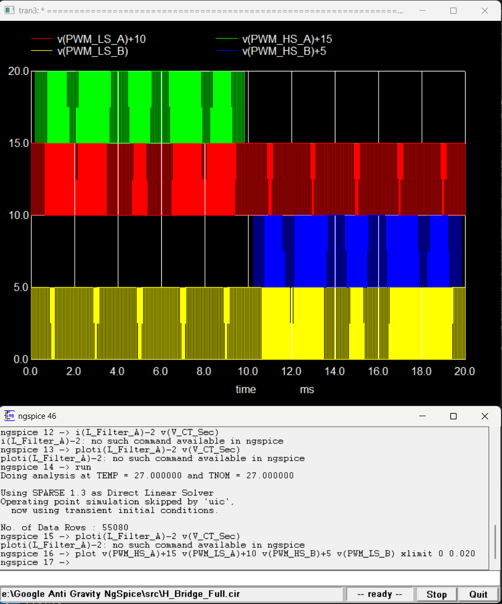
*Full 20ms cycle. Leg A switches at 16kHz during the positive half-cycle while Leg B remains clamped, with roles exchanged at the zero-crossing.*

### 10. Dead-Time Validation
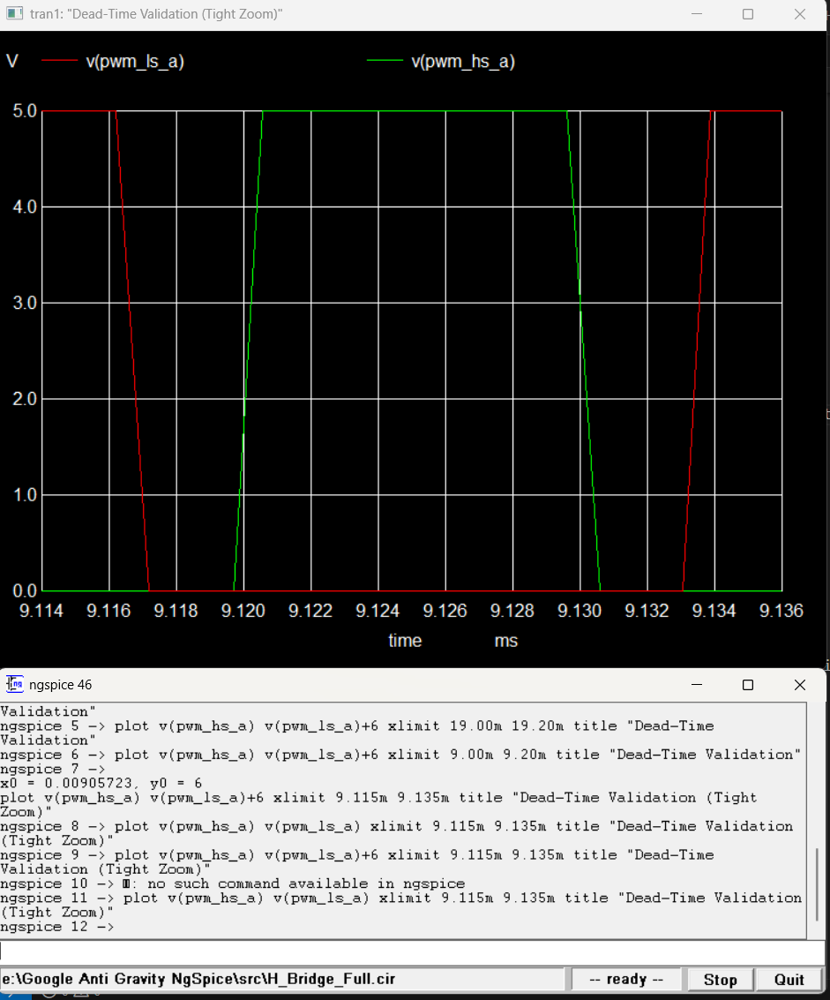
*Single switching event showing the 2µs interval where both gate signals are at 0V.*

### 11. DC Bus Energy Flow
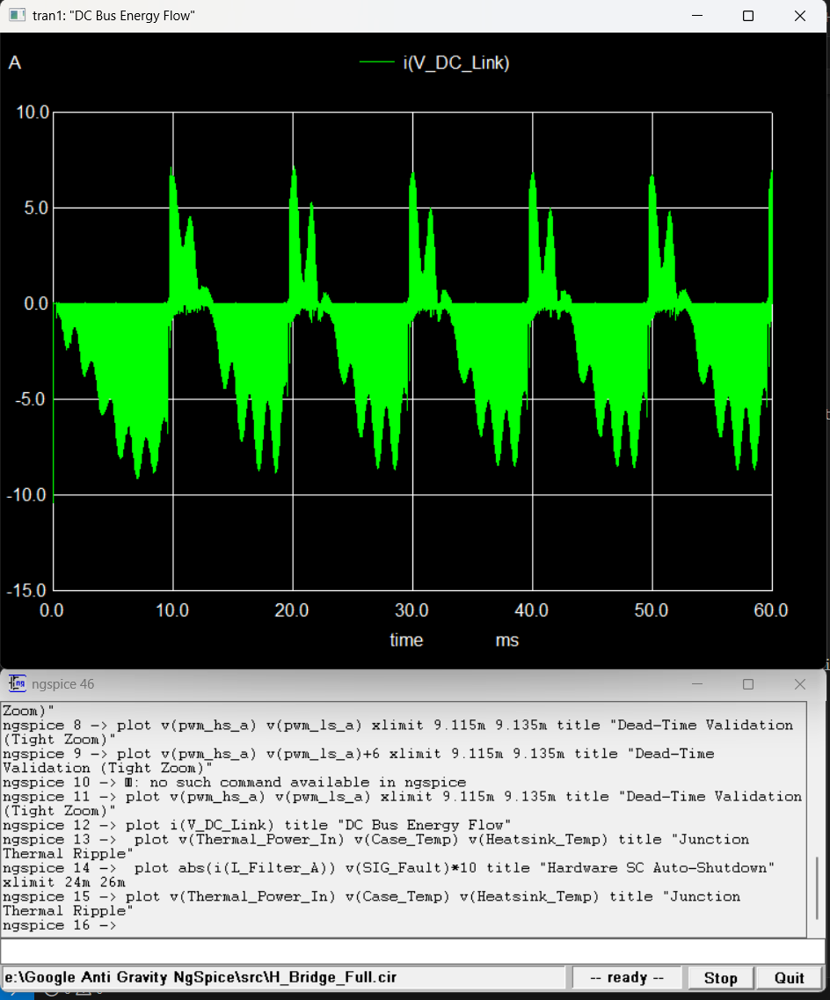
*Four-quadrant energy flow. Negative = load delivery; positive = inductive recirculation through body diodes.*

### 12. Electro-Thermal Junction Ripple
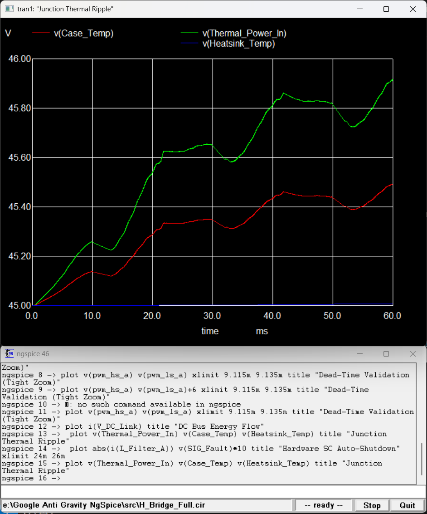
*Foster RC thermal network output. Junction node shows 50Hz ripple; heatsink node stable at 45°C.*

### 13. Short-Circuit Protection (50A Trip-Point)
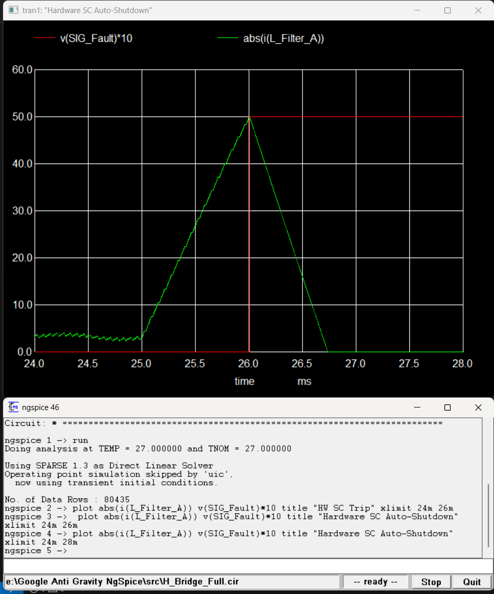
*0.1Ω fault at t=25ms. CT comparator triggers INT0 latch at 50A. Current decays through freewheeling diodes.*

---

## Electro-Thermal IGBT Model

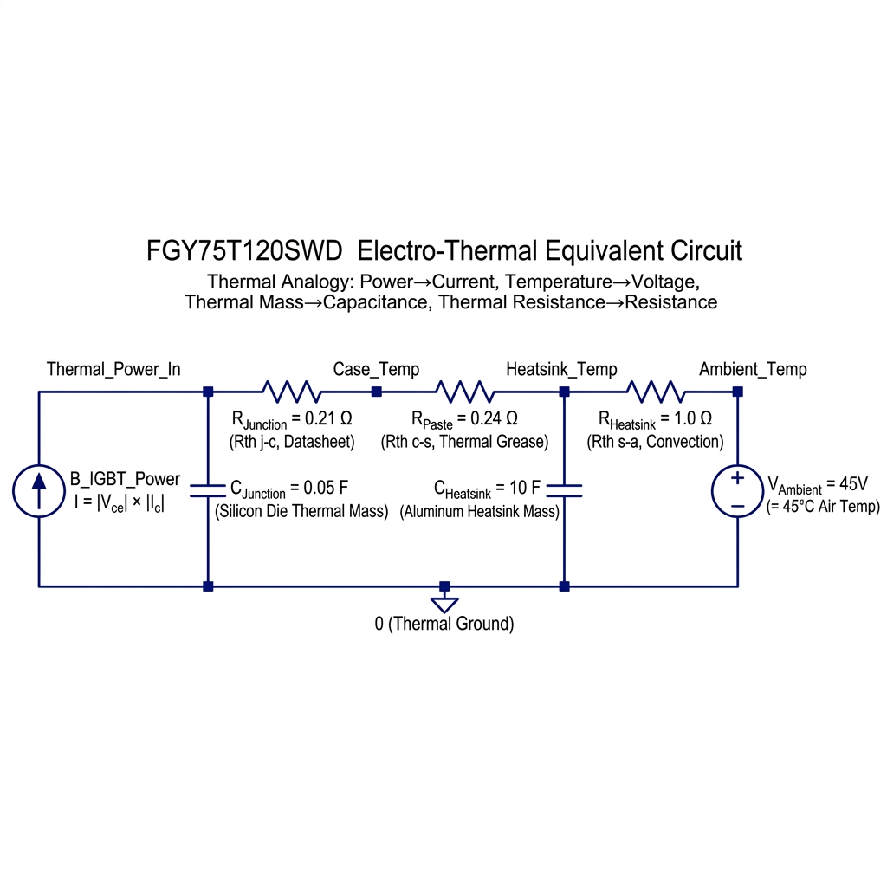

Foster RC thermal network mapping IGBT power dissipation to junction temperature:

| Thermal Domain     | Electrical Equivalent | Unit     |
|--------------------|----------------------|----------|
| Power (Heat Source)| Current Source        | W → A    |
| Temperature        | Voltage               | °C → V   |
| Thermal Mass       | Capacitance           | J/°C → F |
| Thermal Resistance | Resistance            | °C/W → Ω |

**Thermal parameters (onsemi FGY75T120SWD datasheet):**

| Stage                 | Parameter  | Value        | Source                       |
|-----------------------|------------|--------------|------------------------------|
| Junction to Case      | R_Junction | 0.21°C/W     | Datasheet Rth(j-c) max       |
| Junction Thermal Mass | C_Junction | 0.05 F       | Silicon die                  |
| Case to Heatsink      | R_Paste    | 0.24°C/W     | TO-247 + thermal grease      |
| Heatsink to Ambient   | R_Heatsink | 1.0°C/W      | Aluminum, natural convection |
| Heatsink Thermal Mass | C_Heatsink | 10 F         | Aluminum heatsink block      |
| Ambient Temperature   | V_Ambient  | 45V (= 45°C) | Worst-case summer            |

**Steady-state calculation** at P_avg = 40W per IGBT:
> T_junction = 40W × (0.21 + 0.24 + 1.0) + 45°C = **103°C** (below 175°C abs max)

---

## Component Level Modeling

### TLP250H Isolated Gate Driver
- Custom 8-pin behavioral subcircuit: LED sensing, 150ns propagation delay, totem-pole output.
- Protection: 15V Zener (BZT52C15), 10kΩ pull-down, asymmetric turn-on/off resistors (15Ω / 5.6Ω).

### FGY75T120SWD IGBT (onsemi)
- 1200V/75A Field Stop VII: Models Miller Plateau and switching transitions.
- Thermal: Rth(j-c) = 0.21°C/W, Tj_max = 175°C, PD_max = 714W @ Tc=25°C.

### ZMPT101B Voltage Sensor
- 200µs RC delay models transformer coupling + PCB filter (R=2kΩ, C=100nF).
- Scaling: 311V peak → 0.389V peak (0.00125 V/V gain + 0.5V bias).

### Short Circuit Protection (CT + INT0 Latch)
- Current transformer: 1A:1V ratio, full-wave rectified.
- Hardware comparator trips at 50A primary.
- INT0 MCU latch mimics `SPWM_Stop()` on dsPIC INT0 interrupt.

### STGW60H65DFB IGBT (ST Microelectronics)
- 650V/60A Trench Field-Stop IGBT: Behavioral model with Cies, Cres, body diode.
- Used in parallel pair for MPPT boost converter (120A combined rating).

### FOD3150 Isolated Gate Driver
- Behavioral model with LED threshold sensing, 150ns RC propagation delay, totem-pole output.
- Drives IGBT gate with +20V through 11Ω effective gate resistance.

### STTH3006D Ultra-Fast Recovery Diode
- 600V/30A diode with 35ns reverse recovery time.
- Matched for boost converter freewheeling at 20kHz switching.

---

## How to Run

### Requirements
- [NgSpice](https://ngspice.sourceforge.io/) v44 or later
- [Python](https://www.python.org/) v3.10 or later
- Matplotlib, NumPy, Scikit-Learn (for surrogate model)

### Inverter Simulation

**Interactive Mode:**
```spice
ngspice src/H_Bridge_Full.cir
run
plot v(OUT_A, OUT_B)                                    * Output voltage
plot v(OUT_A, OUT_B) i(V_Meter)*20                      * Voltage + current
plot v(PWM_HS_A) v(PWM_LS_A) xlimit 0.009 0.00920       * Dead-time gap
plot v(Thermal_Power_In) v(Case_Temp) v(Heatsink_Temp)   * Thermal
```

**Batch Mode:**
```bash
python run_simulation.py
```

### MPPT Booster Simulation
```bash
python run_mppt_sim.py
```
Edit `src/MPPT_Booster.cir` to select profile (uncomment one at a time).

### Parametric Sweep
```bash
python data_factory.py
```
Sweeps V_DC_Link from 350V to 450V across all THI/DT combinations (44 simulations).

---

## Modulation Strategy Benchmark (400V DC Link)

```text
Strategy             | V_rms Output | I_peak Load | Tj_max (IGBT) | Efficiency
------------------------------------------------------------------------------
Bare SPWM            |    188.7 V   |    7.24 A   |    45.9 °C    |   97.2 %
SPWM + DT Comp       |    192.1 V   |    7.18 A   |    45.5 °C    |   98.1 %
THI (Flat Top)       |    192.8 V   |    7.26 A   |    45.9 °C    |   97.2 %
THI + DT Comp        |    195.5 V   |    7.28 A   |    45.5 °C    |   97.9 %
```

The combined THI + DT Comp strategy recovers ~7V of AC output while the IGBT runs 0.4°C cooler. Uncompensated dead-time gaps cause harmonic distortion that recirculates as I²R heat. Compensating the dead-time in firmware eliminates these losses, improving both voltage output and thermal performance.

---

## NgSpice Compatibility Notes
- `limit()` function is **not supported** in NgSpice 46 B-source expressions (returns 0V).
- `sdt()` integrator function is **not available**; use G-source + Capacitor model instead.
- `.PARAM` variables **cannot be used** inside B-source expressions; hardcode values directly.
- `LAPLACE {}` transfer function syntax inside E-source expressions is not supported in our build.
- Tested on: NgSpice 44/46 (Windows 64-bit).

---

## Roadmap
- [x] TLP250H 8-Pin Behavioral Subcircuit
- [x] FGY75T120SWD IGBT Modeling
- [x] 400V Full H-Bridge Pure Sine (Open-Loop)
- [x] Closed-Loop PI Voltage Regulation
- [x] Inductive Motor Load with Phase Lag Analysis
- [x] ZMPT101B Sensor Delay Modeling (200µs)
- [x] Dead-Time Implementation (2µs safety gap)
- [x] Dead-Time Compensation (Current-Direction Dependent)
- [x] Third Harmonic Injection (1/6th Flat-Top Modulation)
- [x] Short Circuit Protection (CT + Comparator + INT0 Latch)
- [x] Electro-Thermal IGBT Model (Foster RC Network)
- [x] Automated .meas Metrics (8 Engineering Measurements)
- [x] Python Batch Automation (run_simulation.py)
- [x] Parametric Data Factory (44 simulations)
- [x] Modulation Strategy Analysis Engine
- [x] Surrogate Model Training (Scikit-Learn)
- [x] 4kW MPPT Boost Converter (Feed-Forward + PI, 3 Test Profiles)
- [x] MPPT Engineering Report & Firmware Reference
- [ ] PCB Hardware Design (KiCad)

---

## Author
**Nadeem Tahir** — Embedded Systems and Power Electronics Engineer

Designs and builds production-grade inverters and motor drives from schematic to firmware across multiple MCU platforms (dsPIC, PIC, STM32, ESP32).
