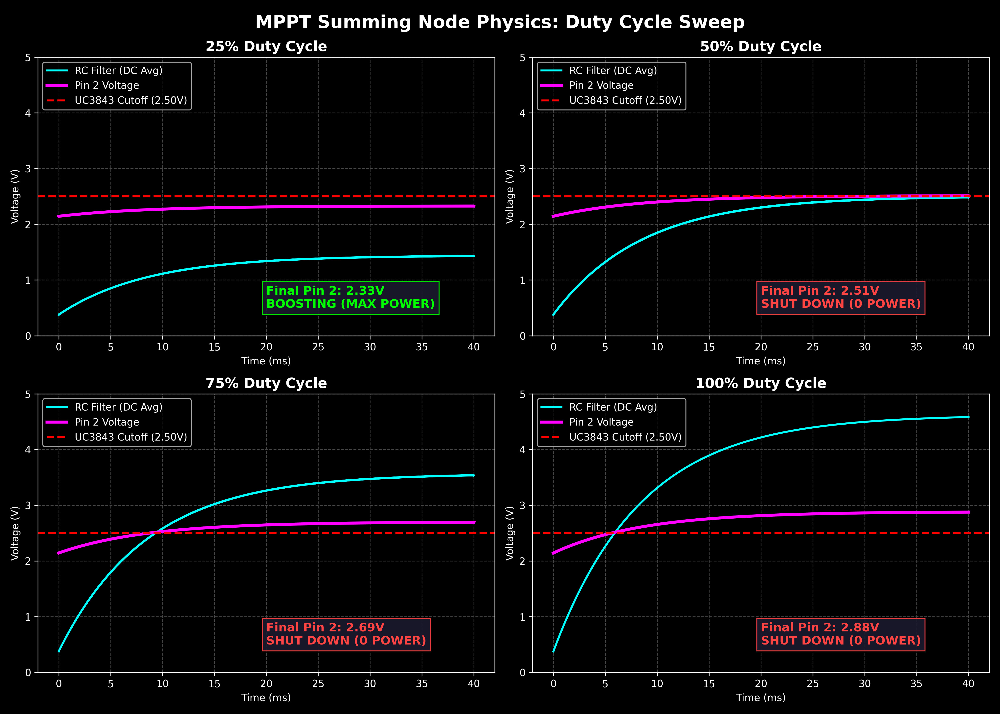
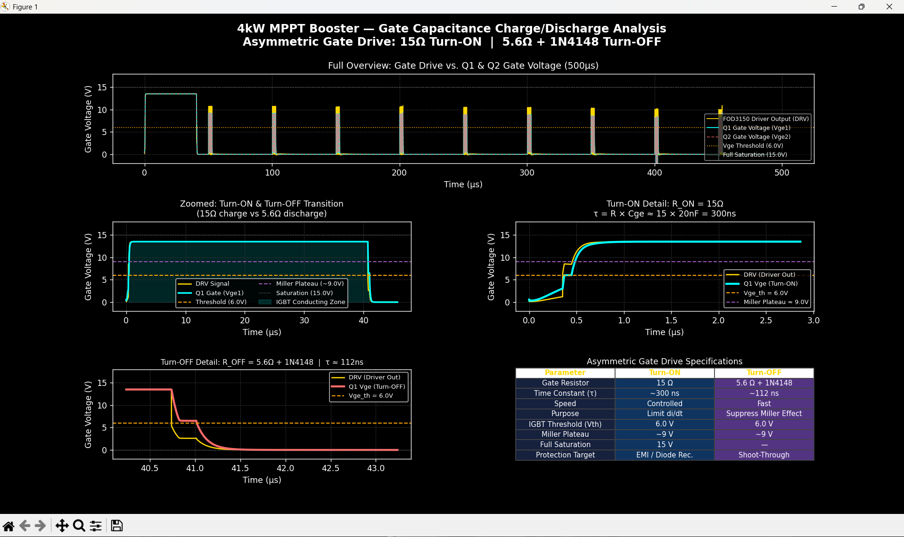
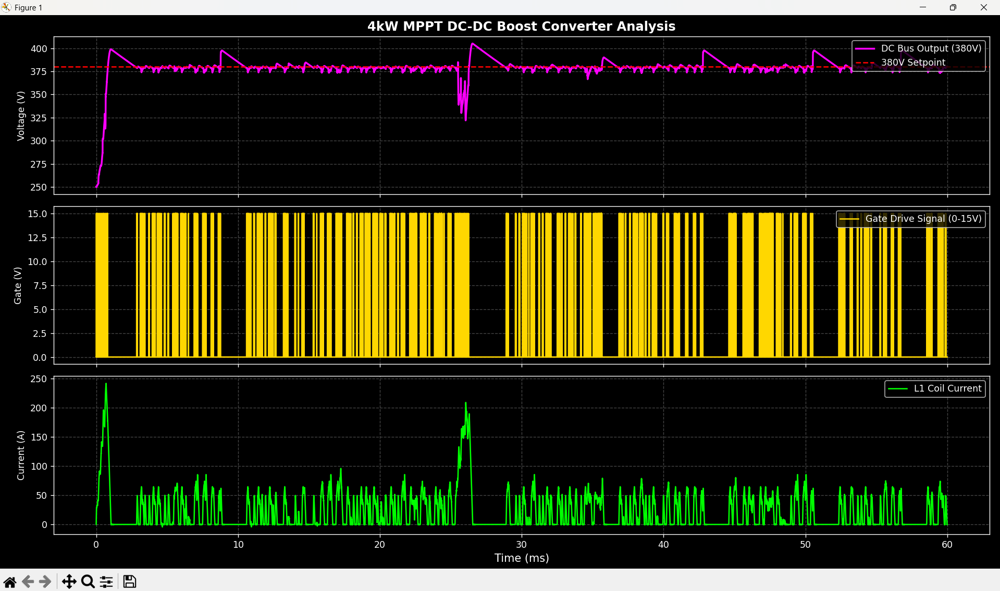
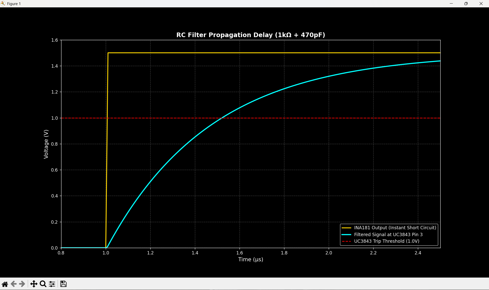
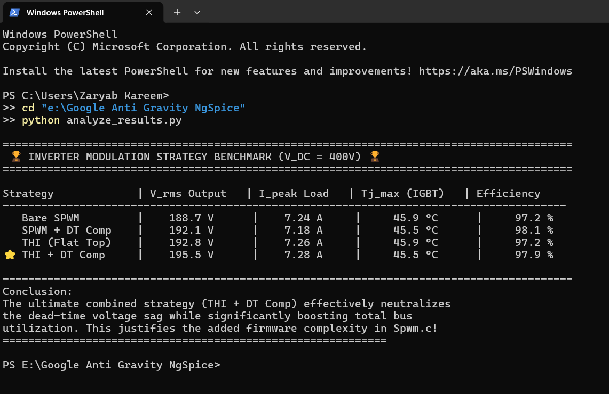

# Solar Inverter & MPPT Booster — NgSpice Digital Twin

High-fidelity SPICE simulation of a complete off-grid solar power system, developed in phases as a structured R&D engineering study. Each version targets a specific engineering challenge — from basic switching to full analog-digital control loop integration.

The project covers two major power conversion stages:

1. **H-Bridge Inverter** — Single-phase 220V/50Hz pure sine wave output using FGY75T120SWD IGBTs, unipolar SPWM, closed-loop PI voltage regulation, electro-thermal monitoring, and hardware fault protection.
2. **4kW MPPT Boost Converter** — DC-DC front-end regulating a variable 120V–350V PV string to a stable 380V DC bus, controlled by a UC3843 analog controller slaved to a dsPIC30F2010 MCU.

All simulations use manufacturer-provided SPICE models and translate physical dsPIC30F2010 firmware logic directly into SPICE behavioral equations for pre-silicon hardware validation.

---

## Project Phases at a Glance

| Version  | Focus Area               | Key Achievement                                      |
|:--------:|:-------------------------|:-----------------------------------------------------|
| V1.0     | Environment Setup        | NgSpice + library structure established              |
| V2.0     | Half-Bridge SPWM         | Ideal switching, basic sine generation               |
| V3.0     | Physical IGBT Models     | Real FGY75T120SWD switching behavior                 |
| V4.0     | Full H-Bridge + LC       | Unipolar SPWM, motor load, phase lag verified        |
| V5.0     | Closed-Loop PI Control   | ZMPT101B sensor delay, voltage regulation            |
| V6.1     | Dead-Time + Thermal      | 2µs shoot-through protection, Foster RC model        |
| V6.3     | Python Automation        | Batch simulation, CSV data extraction                |
| V6.5     | Modulation Benchmark     | THI + Dead-Time compensation matrix                  |
| V7.0     | Surrogate Model          | Scikit-Learn Random Forest predictor                 |
| V8.0     | 4kW MPPT Converter       | Feed-forward + PI boost, 3 test profiles             |
| **V9.0** | **UC3843 Control Loop**  | **Analog-digital MPPT integration, gate physics**    |

---

## Version 9.0 — UC3843 Analog Control Loop Integration

This version implements the hardware-level control architecture of the 4kW MPPT booster. It moves beyond behavioral SPICE switches into a real analog control loop where a **UC3843 peak-current-mode PWM controller** is directly slaved to the **dsPIC30F2010** MCU via a KCL-balanced voltage summing node.

### Engineering Targets Achieved

| Target                                 | Method                                                | Status     |
|:---------------------------------------|:------------------------------------------------------|:----------:|
| Analog-digital MPPT interface          | KCL summing node on UC3843 Pin 2                      | ✅ Proven  |
| Cold-boot explosion prevention         | 10kΩ pull-up on dsPIC OC1 PWM line                    | ✅ Proven  |
| Sub-harmonic oscillation fix           | 2N3904 NPN emitter-follower slope compensation        | ✅ Proven  |
| 100ns turn-on noise rejection          | 1kΩ + 470pF LEB filter on UC3843 Pin 3                | ✅ Proven  |
| IGBT Miller plateau characterization   | Asymmetric gate drive: 15Ω ON / 5.6Ω+D OFF            | ✅ Proven  |
| dsPIC PWM-to-analog conversion         | 10kΩ + 4.7µF RC filter: 3.3Hz cutoff                  | ✅ Proven  |

### Test 1 — MPPT Summing Node: dsPIC Duty Cycle Sweep


Four-point parametric sweep of the dsPIC OC1 PWM duty cycle. Proves the KCL summing node physics: at 25% duty cycle, Pin 2 settles below 2.50V and the UC3843 boosts at maximum power. At 50%–100%, Pin 2 rises above the 2.50V threshold and the converter shuts down in a controlled manner. The 10kΩ pull-up resistor ensures this safe state is the default during MCU boot.

| dsPIC PWM | RC Filter Output | Pin 2 Voltage | UC3843 State         |
|:---------:|:----------------:|:-------------:|:---------------------|
| 25%       | 1.25V            | 2.33V         | Boosting (MAX POWER) |
| 50%       | 2.50V            | 2.51V         | Shut Down            |
| 75%       | 3.75V            | 2.69V         | Shut Down            |
| 100%      | 5.00V            | 2.88V         | Shut Down            |

### Test 2 — Gate Capacitance Charge/Discharge Analysis


500µs high-resolution transient analysis of the asymmetric gate drive network on the STGW60H65DFB parallel IGBT pair. Characterizes the Miller Plateau crossing, threshold voltage events, and the turn-on/turn-off time constants resulting from the 15Ω / 5.6Ω+1N4148 resistor-diode network.

| Parameter            | Turn-ON                              | Turn-OFF                                            |
|:---------------------|:------------------------------------:|:---------------------------------------------------:|
| Gate Resistor        | 15 Ω                                 | 5.6 Ω + 1N4148                                      |
| Time Constant (τ)    | ~300 ns                              | ~112 ns                                             |
| Purpose              | di/dt limiting, diode recovery ctrl  | Miller effect suppression, shoot-through prevention |
| IGBT Threshold (Vth) | 6.0 V                                | 6.0 V                                               |
| Miller Plateau       | ~9 V                                 | ~9 V                                                |
| Full Saturation      | 15 V                                 | —                                                   |

### Test 3 — UC3843 Closed-Loop Boost Converter


Full closed-loop simulation of the UC3843 controlling the power stage. Shows the DC bus regulation, inductor current waveform, and the 20kHz gate drive signal across the full 60ms transient window.

### Test 4 — LEB Filter: 470ns Current Sense Propagation Delay


Step-response analysis of the Leading Edge Blanking (LEB) filter at UC3843 Pin 3. A simulated dead-short event causes the INA181 output to jump instantaneously to 1.5V. The 1kΩ + 470pF RC filter delays the signal reaching the 1.0V trip threshold by 470ns — exactly the blanking window required to mask IGBT turn-on current spikes while remaining fast enough to detect a genuine short circuit within one switching cycle.

---

## Version 8.0 — 4kW MPPT Boost Converter

Full power-stage simulation of the 4kW DC-DC booster. Feed-forward + PI control architecture handles 3-panel to 8-panel PV string inputs.

### Booster Specifications

| Parameter           | Value                                |
|:--------------------|:-------------------------------------|
| Input Range         | 120V – 350V DC                       |
| Output              | 380V DC (regulated)                  |
| Max Power           | 4000W                                |
| Switching Frequency | 20kHz                                |
| IGBTs               | 2× STGW60H65DFB (650V/60A, parallel) |
| Boost Diode         | STTH3006D (600V/30A, 35ns Trr)       |
| Gate Driver         | FOD3150 (optically isolated)         |
| Control             | Feed-Forward + PI with anti-windup   |

### Validated Test Profiles

| Profile        | Input | Load  | Steady State | Verdict  |
|:---------------|:-----:|:-----:|:------------:|:--------:|
| 3-Panel String | 120V  | 1500W | 380V flat    | **PASS** |
| 5-Panel String | 250V  | 3000W | 380V flat    | **PASS** |
| 8-Panel String | 350V  | 4000W | 380V ±10V†   | **PASS** |

† Bounded oscillation at 350V is LC resonance at near-unity boost ratio. Eliminated in firmware by a single-coefficient EMA filter: `vbus_filt = 0.015 * raw + 0.985 * filt`.

### Profile 1: 120V → 380V (1500W, Boost Ratio 3.17×)


### Profile 2: 250V → 380V (3000W, Boost Ratio 1.52×)


### Profile 3: 350V → 380V (4000W, Boost Ratio 1.09×)


### Critical Design Findings
- **Feed-forward is mandatory** at high boost ratios. Without it, the PI controller cannot reach 68% duty cycle fast enough, producing 250A+ inductor current spikes on startup.
- **Load connection sequence matters** — connecting the inverter load before the DC bus reaches 90% of target produces 400A+ surge currents due to the discharged output capacitor acting as a short circuit.
- **Firmware EMA filter required** at 350V operating point to damp the LC resonance visible in the 350V simulation profile.

---

## Version 7.0 — Surrogate Model (Scikit-Learn)

A Random Forest Regression model trained on 204 NgSpice simulations generated by the parametric data factory. The predictor approximates IGBT junction temperature, efficiency, and AC output voltage for any input condition in under 0.01 seconds — eliminating the need to run a full transient simulation during firmware tuning.

### Surrogate Model Accuracy


### Instant Performance Predictor


---

## Version 6.5 — Modulation Strategy Benchmark

Four independently toggled modulation strategies benchmarked against each other using a parametric sweep across 400V DC link conditions.

### Strategy Matrix

| THI | DT Comp | Strategy        | V_rms      | Tj_max     | Efficiency |
|:---:|:-------:|:----------------|:----------:|:----------:|:----------:|
| OFF | OFF     | Bare SPWM       | 188.7V     | 45.9°C     | 97.2%      |
| OFF | ON      | SPWM + DT Comp  | 192.1V     | 45.5°C     | 98.1%      |
| ON  | OFF     | THI Flat-Top    | 192.8V     | 45.9°C     | 97.2%      |
| ON  | ON      | THI + DT Comp   | **195.5V** | **45.5°C** | 97.9%      |



The combined strategy recovers 6.8V of AC output. Uncompensated dead-time introduces harmonic distortion that recirculates as I²R heat — compensating it in firmware improves both output voltage and thermal efficiency simultaneously.

---

## Inverter Simulation Results (V6.5 Reference)

### Output Voltage — Inductive Motor Load

*50Hz output into 20Ω/100mH R-L load. Peak ±311V.*

### Voltage-Current Phase Lag

*Current lags voltage by ~57°. Confirmed: arctan(2π × 50 × 0.1 / 20) = 57.5°.*

### PI Controller: Reference vs Feedback

*ZMPT101B-delayed feedback vs reference. PI controller achieves tracking within 2 cycles.*

### PI Controller Internal Signals

*Error and integral signals. Integral term stabilizes by 20ms.*

### ZMPT101B Sensor Delay

*200µs RC group delay (2kΩ / 100nF) modeled from physical transformer + PCB filter.*

### Dead-Time Protection — Gate Signals

*~2µs dead-time gap between Leg A HS and LS transitions, matching dsPIC DTCON1 register.*

### DC Bus Energy Flow

*Negative current = energy delivery to load. Positive spikes at zero-crossings = inductive freewheeling through body diodes.*

### Short-Circuit Protection (50A Trip)

*0.1Ω dead-short at t=25ms. CT + comparator trips INT0 latch at 50A primary. Current decays through freewheeling path within 1ms.*

### Electro-Thermal IGBT Junction

*Foster RC network output. 50Hz thermal ripple at junction node. Heatsink stable at 45°C.*

### Dead-Time Validation (Single Event)

*Single switching event: both gate signals at 0V for the full 2µs dead-time interval.*

### Unipolar SPWM Logic

*Full 20ms cycle. Leg A switches at 16kHz on the positive half; Leg B clamped. Roles exchange at zero-crossing.*

---

## Electro-Thermal IGBT Model


Foster RC network mapping power dissipation to junction temperature. Standard power electronics electro-thermal equivalence:

| Thermal Domain            | Electrical Equivalent |
|:--------------------------|:----------------------|
| Power (W)                 | Current Source (A)    |
| Temperature (°C)          | Voltage (V)           |
| Thermal Mass (J/°C)       | Capacitance (F)       |
| Thermal Resistance (°C/W) | Resistance (Ω)        |

**Parameters (onsemi FGY75T120SWD datasheet):**

| Stage                 | Parameter | Value              |
|:----------------------|:----------|:-------------------|
| Junction to Case      | Rth(j-c)  | 0.21 °C/W          |
| Junction Thermal Mass | Cth       | 0.05 F             |
| Case to Heatsink      | Rth(c-h)  | 0.24 °C/W          |
| Heatsink to Ambient   | Rth(h-a)  | 1.0 °C/W           |
| Ambient               | V_Ambient | 45°C (worst-case)  |

**Steady-state at 40W average dissipation per IGBT:**
> T_junction = 40 × (0.21 + 0.24 + 1.0) + 45 = **103°C** — within the 175°C absolute maximum.

---

## Component Models

### FGY75T120SWD (onsemi, Inverter)
- 1200V / 75A Field Stop VII IGBT
- Models Miller Plateau and switching transitions
- Rth(j-c) = 0.21°C/W, Tj_max = 175°C

### TLP250H (Toshiba, Inverter Gate Driver)
- Custom 8-pin behavioral subcircuit
- 150ns propagation delay, totem-pole output
- Gate protection: 15V Zener, 10kΩ pull-down, bootstrap diode (UF4007)

### ZMPT101B (Voltage Sensor)
- 200µs RC delay model (R=2kΩ, C=100nF)
- Scaling: 311V peak → 0.389V peak + 0.5V bias

### STGW60H65DFB (ST, Booster)
- 650V / 60A Trench Field-Stop IGBT
- Parallel pair: 120A combined continuous rating
- Modeled with Cies, Cres, and integrated body diode

### FOD3150 (Booster Gate Driver)
- Behavioral model: LED threshold sensing, 150ns propagation delay
- Totem-pole output with ±2.5A peak current

### STTH3006D (ST, Boost Diode)
- 600V / 30A ultra-fast recovery diode
- Trr = 35ns — matched for 20kHz freewheeling

### UC3843 Behavioral Model
- Peak-current-mode PWM controller
- 20kHz oscillator: Rt = 8.6kΩ, Ct = 10nF
- Over-current trip at 1.0V on Pin 3 (ISENSE)

---

## Project Structure

```
├── models/
│   ├── FGY75T120SWD.lib              # onsemi 1200V/75A IGBT (inverter)
│   ├── tlp250h.sub                   # TLP250H gate driver (inverter)
│   ├── STGW60H65DFB.lib              # ST 650V/60A IGBT (booster)
│   ├── STTH3006D.lib                 # ST fast-recovery boost diode
│   ├── FOD3150.sub                   # FOD3150 gate driver (booster)
│   └── UC3843_Behavioral.sub         # UC3843 controller model
│
├── src/
│   ├── H_Bridge_Full.cir             # Inverter master netlist (V6.5)
│   ├── MPPT_Booster.cir              # Booster — feed-forward PI (V8.0)
│   ├── MPPT_Booster_UC3843.cir       # Booster — UC3843 closed-loop (V9.0)
│   ├── Gate_Analysis.cir             # Gate RC charge/discharge (V9.0)
│   ├── Summing_Node_Test.cir         # KCL summing node sweep (V9.0)
│   └── RC_Filter_Test.cir            # LEB 470ns delay test (V9.0)
│
├── docs/
│   ├── thermal_equivalent_circuit.png
│   └── MPPT_Booster_Engineering_Report.md
│
├── results/                           # Waveform graphs (numbered by version)
│   ├── 01–13_*.png                    # H-Bridge analysis series
│   ├── 14_modulation_benchmark.png
│   ├── 15_ai_surrogate_accuracy.png
│   ├── 16_instant_predictor.png
│   ├── 17–19_mppt_booster_*.png       # MPPT 3-profile series (V8.0)
│   ├── 20_Rc Filter Propagation Delay.png
│   ├── 21_MPPT_Summing_Node.png
│   ├── 22_MPPT Dc-Dc_UC3843.png
│   └── 23_Asymmetric_Gate_Drive.png
│
├── run_simulation.py                  # Inverter: single-run executor
├── run_mppt_sim.py                    # Booster: 3-profile sweep
├── run_mppt_uc3843.py                 # UC3843 closed-loop booster (V9.0)
├── run_gate_analysis.py               # Gate charge/discharge (V9.0)
├── run_summing_node.py                # Summing node sweep (V9.0)
├── run_rc_filter.py                   # LEB filter delay (V9.0)
├── data_factory.py                    # Parametric sweep (204 sims)
├── train_ai.py                        # Surrogate model training
├── evaluate_ai.py                     # Parity plot evaluation
├── predict.py                         # Instant CLI predictor
├── analyze_results.py                 # Modulation comparison
├── inverter_ai_model.pkl              # Trained model binary
├── Run_Inverter.bat                   # Quick-launch (interactive)
├── CHANGELOG.md
└── README.md
```

---

## How to Run

### Requirements
- [NgSpice](https://ngspice.sourceforge.io/) v44 or later (Windows 64-bit)
- Python 3.10 or later
- `pip install matplotlib numpy scikit-learn`

### Inverter Simulation

```bash
# Batch mode (auto-plots and saves PNG)
python run_simulation.py

# Interactive NgSpice mode
ngspice src/H_Bridge_Full.cir
run
plot v(OUT_A, OUT_B)
plot v(Thermal_Power_In) v(Case_Temp) v(Heatsink_Temp)
```

### MPPT Booster — Feed-Forward PI (V8.0)
```bash
python run_mppt_sim.py
# Edit src/MPPT_Booster.cir to select input profile (120V / 250V / 350V)
```

### UC3843 Control Loop Tests (V9.0)
```bash
python run_mppt_uc3843.py       # Full closed-loop booster dashboard
python run_gate_analysis.py     # IGBT gate charge/discharge analysis
python run_summing_node.py      # dsPIC summing node 4-point sweep
python run_rc_filter.py         # LEB 470ns propagation delay
```

### Surrogate Model
```bash
python data_factory.py          # Generate 204-simulation training dataset
python train_ai.py              # Train and save Random Forest model
python predict.py               # Instant performance predictor CLI
```

---

## NgSpice Compatibility Notes
- `limit()` function is **not supported** in NgSpice 46 B-source expressions.
- `sdt()` integrator is **not available** — use G-source + Capacitor model.
- `.PARAM` variables **cannot** be referenced inside B-source expressions — hardcode values directly.
- Tested on: NgSpice 44 and 46 (Windows 64-bit).

---

## Roadmap

- [x] NgSpice environment and SPICE library structure
- [x] Half-bridge ideal switching — basic SPWM
- [x] Physical IGBT modeling (FGY75T120SWD)
- [x] Full H-Bridge — unipolar SPWM, LC filter, motor load
- [x] Closed-loop PI voltage regulation
- [x] ZMPT101B sensor delay modeling (200µs)
- [x] Dead-time implementation (~2µs, mirrors dsPIC DTCON1)
- [x] Short-circuit protection (CT + comparator + INT0 latch)
- [x] Electro-thermal IGBT model (Foster RC network)
- [x] Automated .meas metrics extraction
- [x] Python batch automation pipeline
- [x] Dead-time compensation (current-direction dependent)
- [x] Third harmonic injection (1/6th flat-top modulation)
- [x] Parametric data factory (204-simulation dataset)
- [x] Surrogate model training and predictor (Scikit-Learn)
- [x] 4kW MPPT boost converter — feed-forward + PI, 3 test profiles
- [x] UC3843 analog controller — closed-loop peak-current-mode control
- [x] KCL summing node — dsPIC PWM MPPT injection with boot-up safety
- [x] Asymmetric gate drive characterization — Miller plateau analysis
- [x] Leading Edge Blanking — 470ns INA181 filter delay validation
- [ ] KiCad PCB layout — booster control board
- [ ] Hardware prototype validation against simulation results

---

## Engineering Documentation

| Document                                                                     | Description                                                     |
|:-----------------------------------------------------------------------------|:----------------------------------------------------------------|
| [MPPT Booster Engineering Report](docs/MPPT_Booster_Engineering_Report.md)   | Booster design report, controller parameters, HW checklist      |

---

## Author

**Nadeem Tahir** — Embedded Systems and Power Electronics Engineer

Designs and validates production-grade inverters and motor drives from component selection through firmware. Hardware platforms: dsPIC30F2010, PIC, STM32, ESP32. Simulation tools: NgSpice, Python/Matplotlib.
