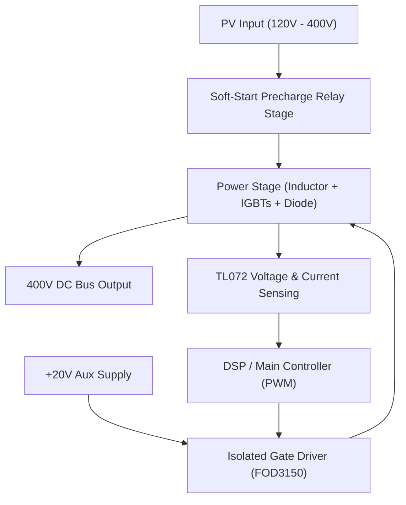

# 4000W Chinese MPPT Booster Architecture

This document serves as the master design reference for the 4kW MPPT Card used in modern high-voltage solar hybrid inverters (e.g., Voltronic Axpert, Growatt).

## 1. System Block Diagram



---

## 2. Stage 1: Soft-Start Pre-Charge Schematics

The pre-charge circuit prevents catastrophic inrush currents into the empty 400V DC bus capacitors when the solar panels are first connected.

```text
SOLAR (+) ───┬───────────────────────────────────┬─────────► To Inductor
             │                                   │
             │     ┌───[ 50Ω / 50W Resistor ]──┐ │
             │     │                           │ │
             └─────┼──── RELAY CONTACTS ───────┼─┘
                   │       (NO State)          │
                   └───────────────────────────┘
                           │
                         RELAY COIL
                           │
                      [Precharge CTRL]
```
**Function:** 
1. At power ON, the relay is open. Current flows through the 50Ω resistor, safely charging the massive 400V capacitors.
2. Once the DC Bus reaches ~350V, the controller clicks the relay closed.
3. The 50Ω resistor is bypassed, allowing the full 35A current to flow freely.

---

## 3. Stage 2: Main Boost Power Stage Scheme

This is the core MPPT boosting mechanism using dual-parallel IGBTs.

```text
From Pre-charge  ──┬─────────────────[ L1: 500µH / 50A ]──────────┬───────────► +400V DC BUS
(120V - 400V)    │                   (Toroidal Core)              │
                 │                                                │
               ──┴── C_in                                         │  D1
               ──┬── (470µF / 400V)                             ──┴── Diode (STTH3006D)
                 │                                              ──┬── 600V / 30A 
                 │                                                │
                 │              DRAIN/COLLECTOR                   │
                 │                 ┌───────────────┬──────────────┘
                 │                 │               │
                 │               │-│              │-│
                 │           Q1  │ │          Q2  │ │
                 │ (STGW60H65DFB)│ │(STGW60H65DFB)│ │
                 │               │ │               │ │
                 │               ─┬─              ─┬─
                 │    GATE        │                │
[PWM from FOD3150] ────┬─[22Ω]────┤                │
                       │          │                │
                       └─[22Ω]────┤                │
                                  │                │
                                  └────────┬───────┘
                                           │
SOLAR (-) ───────┴─────────────────────────┴──────────────────────────┴───────► GND
                 │                                                    │
                 │                                                  ──┴── C_out
             GND (Earth/Chassis)                                    ──┬── (4x 220µF / 450V)
                                                                      │
                                                                     GND
```
**Function:** 
- The IGBTs are pulsed at `~20kHz`.
- When closed, energy is stored in `L1` (500µH).
- When open, `L1` discharges through the `STTH3006D` ultrafast diode into the 400V DC Bus capacitors.
- Parallel IGBTs divide the thermal dissipation evenly.

---

## 4. Stage 3: Isolated Gate Drive (FOD3150)

To fully saturate the IGBTs, a robust 20V isolated drive is essential.

```text
                  +20V (Aux Supply)
                       │
                       │
             ┌─────────┴─────────┐
             │ 8) VCC        6)VO├───► To IGBT Gates (via 22Ω Resistors)
             │                   │
DSP PWM ─────┤ 2) ANODE          │      
             │      FOD3150      │
 GND ────────┤ 3) CATHODE    5)VE├───► To IGBT Emitters (Power GND)
             │                   │
             └───────────────────┘
```
**Function:**
- Provides optical isolation between the low-voltage DSP control board and the high-voltage IGBTs.
- Drives the gate with a +20V hard saturation pulse, ensuring zero switching loss due to slow turn-on.

---

## 5. Stage 4: Voltage & Current Sensing (TL072)

```text
        [470kΩ]                              [ACS712-30A or Hall Sensor]
           │                                          │
+400V ─────┤      Voltage Divider                     ├──► Current Signal (0-3.3V)
           │      scales to 3.3V                      │
        [3.3kΩ]                                       │
           │                                          │
           ├────────► To TL072 (Op-Amp A)             ├────────► To TL072 (Op-Amp B)
           │          Buffer & Filtering              │          Scaling & Filtering
          GND                 │                                          │
                              ▼                                          ▼
                      To DSP ADC Pin 1                           To DSP ADC Pin 2
```
**Function:**
- Scales down the lethal 400V output to a safe, logic-level 3.3V reference.
- Filters switching noise using the `TL072` JFET dual op-amp before feeding the signals to the main processor's Analog-to-Digital Converter (ADC) for MPPT tracking.
